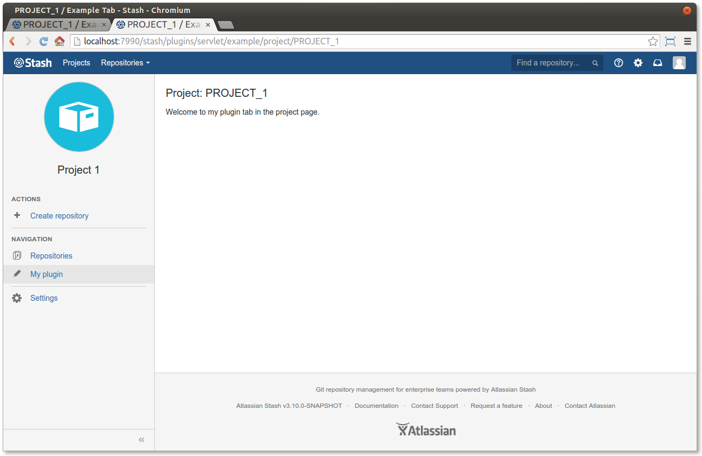
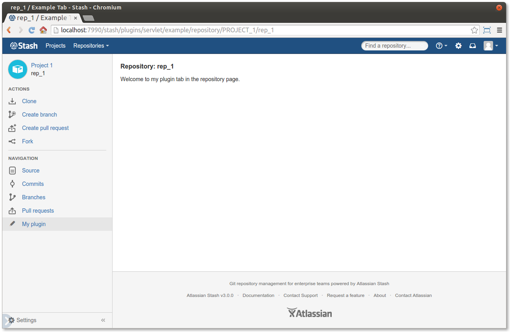
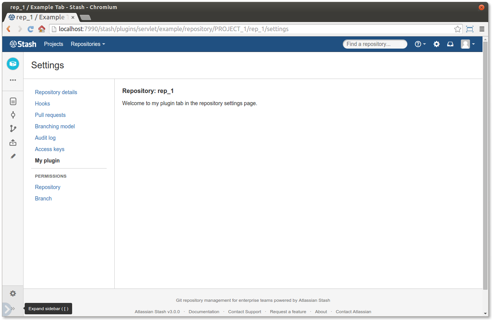
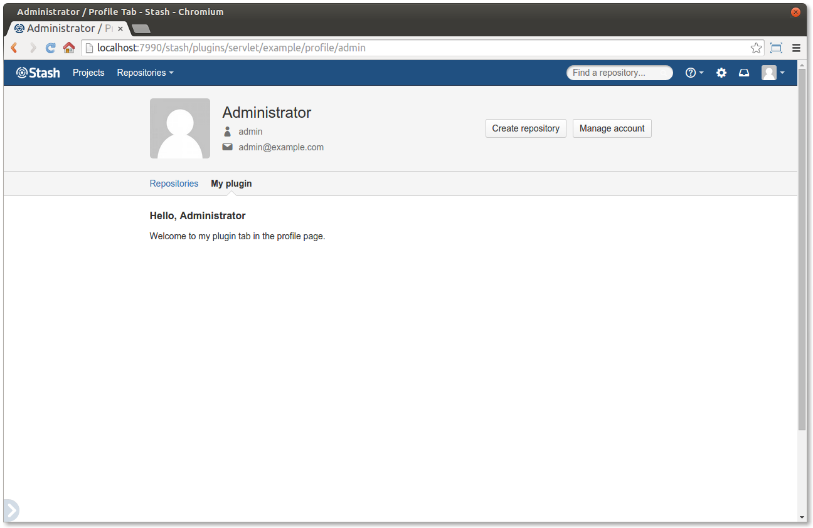

# Bitbucket Server plugin decorating tutorials

This is the Atlassian Bitbucket Server example plugin for decorating various pages around Bitbucket Server.
See the [Bitbucket Server developer documentation](https://developer.atlassian.com/bitbucket/server/docs/latest/reference/plugin-decorators.html)
for a list of the available decorators in Bitbucket Server 4.x.

----

## Project decorator

Add a tab with content to the project page.

----

## Repository decorator

Add a tab with content to the repository page.

Repository settings page

----

## User profile decorator

[User profile tutorial](https://developer.atlassian.com/bitbucket/server/docs/latest/tutorials-and-examples/decorating-the-user-profile.html) – add content to the user profile page.

----

## User account decorator

[User account tutorial](https://developer.atlassian.com/bitbucket/server/docs/latest/tutorials-and-examples/decorating-the-user-account.html) – add content to the user account page.

----

Here are the SDK commands you'll use immediately:

* `atlas-run`   -- installs this plugin into the product and starts it on localhost
* `atlas-debug` -- same as atlas-run, but allows a debugger to attach at port 5005
* `atlas-cli`   -- after atlas-run or atlas-debug, opens a Maven command line window:
                 - `pi` reinstalls the plugin into the running product instance
* `atlas-help`  -- prints description for all commands in the SDK

Full documentation is always available at:

https://developer.atlassian.com/display/DOCS/Introduction+to+the+Atlassian+Plugin+SDK
