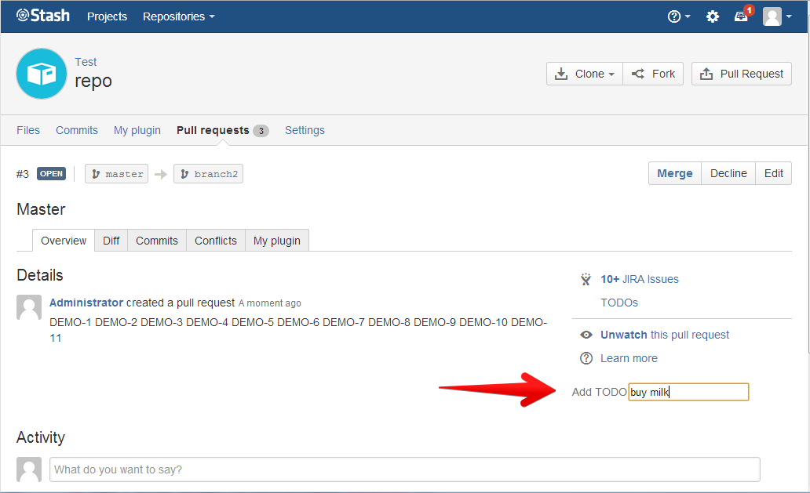
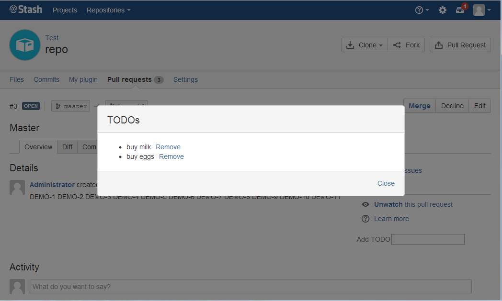

This plugin adds a TODO list into the pull request UI.

It is reference material for the [Pull Request Overview tutorial](https://developer.atlassian.com/bitbucket/server/docs/latest/tutorials-and-examples/pull-request-overview.html).

It adds UI for displaying and adding TODOs:

And a dialog that lists the TODOs:

